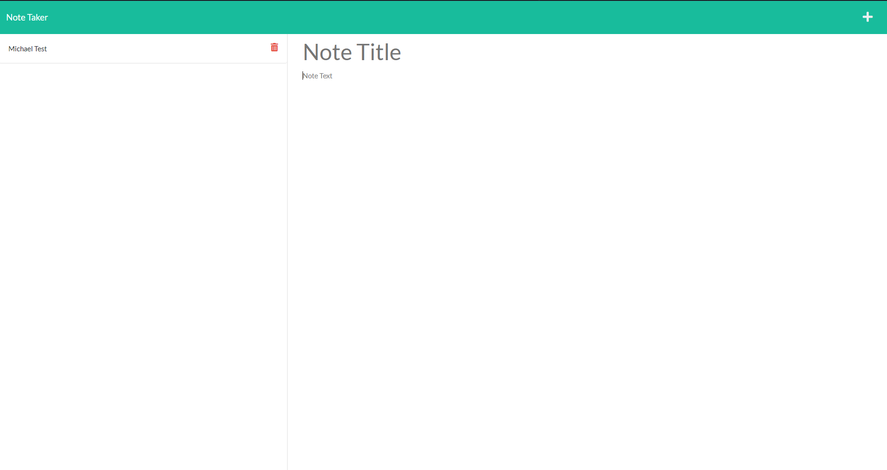

# Note Taker
## Description
An application that uses a local database to store, display, and delete notes that the user provides.

## Table of Contents
- [Installation](#installation)
- [Usage](#usage)
- [Contributing](#contributing)
- [License](#license)
- [Tests](#tests)
- [Questions](#questions)

## Installation
Clone from the [github repository](https://github.com/MHranek/Note-Taker) and open in your favorite code editor

## Usage
From the [Home Page](https://pure-plains-26454.herokuapp.com/), click the 'Get Started' button to go to the notes page. From there you can create new notes, select a previously created note from the list on the side, and delete notes from the list by clicking the trash icon. 

## Contributing
Github, Heroku

## License
MIT License

Copyright (c) 2022 MHranek

Permission is hereby granted, free of charge, to any person obtaining a copy
of this software and associated documentation files (the "Software"), to deal
in the Software without restriction, including without limitation the rights
to use, copy, modify, merge, publish, distribute, sublicense, and/or sell
copies of the Software, and to permit persons to whom the Software is
furnished to do so, subject to the following conditions:

The above copyright notice and this permission notice shall be included in all
copies or substantial portions of the Software.

THE SOFTWARE IS PROVIDED "AS IS", WITHOUT WARRANTY OF ANY KIND, EXPRESS OR
IMPLIED, INCLUDING BUT NOT LIMITED TO THE WARRANTIES OF MERCHANTABILITY,
FITNESS FOR A PARTICULAR PURPOSE AND NONINFRINGEMENT. IN NO EVENT SHALL THE
AUTHORS OR COPYRIGHT HOLDERS BE LIABLE FOR ANY CLAIM, DAMAGES OR OTHER
LIABILITY, WHETHER IN AN ACTION OF CONTRACT, TORT OR OTHERWISE, ARISING FROM,
OUT OF OR IN CONNECTION WITH THE SOFTWARE OR THE USE OR OTHER DEALINGS IN THE
SOFTWARE.

## Tests
N/A

## Questions
GitHub profile: [MHranek](https://www.github.com/MHranek)

Email me at: [mhranekdev@gmail.com](mailto:mhranekdev@gmail.com)  
This README was generated with [README Generator](https://github.com/MHranek/README-Generator)
